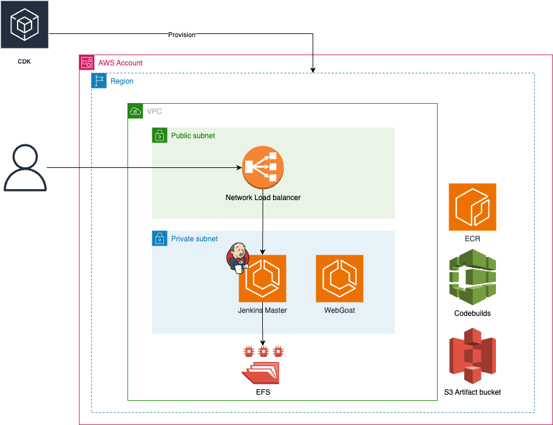
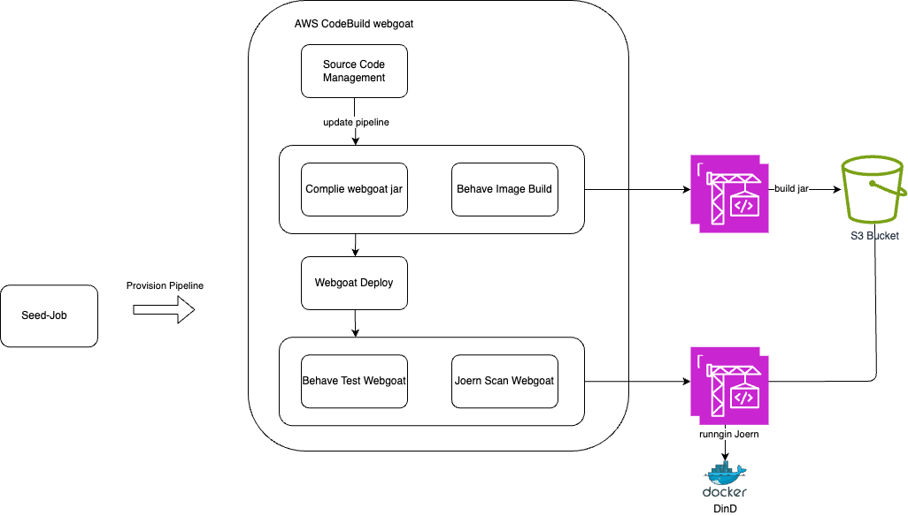

# DevSecOps Jenkins Scanner

This guide provides step-by-step instructions for setting up a DevSecOps Jenkins scanner using AWS native services and Jenkins. Follow these instructions to automate security scanning in a webgoat application using CDK for infrastructure provisioning and Jenkins DSL for pipeline configuration.

## 1 Objective

The objective of this installation guide is to demonstrate how to use AWS native services and Jenkins to start automation security scanning in a webgoat application. The guide will cover the use of CDK for infrastructure provisioning and Jenkins DSL for pipeline configuration.

## 2 Technical Stack

The following technical stack will be used in this installation:

- [CDK](https://aws.amazon.com/cdk/?nc1=h_ls) - IaC, provides a library of constructs that cover many AWS services and features
- Jenkins - Jenkins is an open source automation server. It helps automate the parts of software development
    - [Jenkins Configuration as Code](https://abrahamntd.medium.com/automating-jenkins-setup-using-docker-and-jenkins-configuration-as-code-897e6640af9d)
    - Groovy
- [Codebuild](https://aws.amazon.com/codebuild/) - Build Server / Jenkins agent
    - [Integrating AWS CodeBuild into Jenkins pipelines](https://jenkinshero.com/integrating-aws-codebuild-into-jenkins-pipelines/)
- [Joern](https://github.com/joernio/joern) - analyzing source code, bytecode, and binary executables
- [WebGoat](https://owasp.org/www-project-webgoat/) - insecure application that allows developers to test vulnerabilities commonly

### 2.1 Overall Architecture

The stack will be provisioned using CDK. Please refer to the provided architecture diagram for an overview.


### 2.2 Folder Layout

The project has the following folder layout:

```
devsecops-jenkins-scanner
├── README.md
├── cdk-jenkins - CDK code
├── gauntlt - BDD scanning configuration file
├── jenkins-master-image - Jenkins configuration file
└── local - local docker development
```

## 3 Prerequisites

Before starting the installation, ensure that the following prerequisites are met:

- Docker installed
- AWS account with CLI access (`AWS_ACCESS_KEY_ID` and `AWS_SECRET_ACCESS_KEY`)

## 4 Provision

Follow the steps below to install and configure the DevSecOps Jenkins scanner.

### 4.1 AWS Resource Creation

#### 4.1.1 Manual setup in local

1. Download the source code from the repository: `git clone https://github.com/yiuc/devsecops-jenkins-scanner`
2. Set up the environment:
    
    ```bash
    export AWS_PAGER=
    export AWS_REGION=ap-southeast-1
    export ACCOUNT=$(aws sts get-caller-identity --out json --query 'Account' | sed 's/"//g')
    
    ```
    
3. Create a private ECR repository for the "jenkins-master" image:
    
    ```bash
    aws ecr create-repository --repository-name jenkins-master --image-scanning-configuration scanOnPush=false --region $AWS_REGION
    
    ```
    
4. Manually build the Jenkins master image and upload it to ECR:
    
    ```bash
    docker build --platform linux/amd64 -t jenkins-master jenkins-master-image/. \
    aws ecr get-login-password --region $AWS_REGION | docker login --username AWS --password-stdin $ACCOUNT.dkr.ecr.$AWS_REGION.amazonaws.com \
    docker tag jenkins-master:latest $ACCOUNT.dkr.ecr.$AWS_REGION.amazonaws.com/jenkins-master:latest \
    docker push $ACCOUNT.dkr.ecr.$AWS_REGION.amazonaws.com/jenkins-master:latest
    
    ```
    
5. List the Jenkins-master image in your ECR repository:
    
    ```bash
    aws ecr list-images --repository-name jenkins-master --region $AWS_REGION --output table
    
    ```
    
#### 4.1.2 Provision AWS resources

Follow the steps below to install and configure the DevSecOps Jenkins scanner:

1. Build the local Docker image and access the base environment:
    
    ```bash
    docker build -t my-aws-cli-image ./local
    docker run -v $(pwd):/app --rm -it my-aws-cli-image:latest sh

    for window
    docker run -v %cd%:/app --rm -it my-aws-cli-image:latest sh
    
    ```
    
2. Copy the `AWS_ACCESS_KEY_ID` and `AWS_SECRET_ACCESS_KEY` into the Docker container and set the environment variables:
    
    ```bash
    export AWS_PAGER=
    export AWS_REGION=ap-southeast-1
    export ACCOUNT=$(aws sts get-caller-identity --out json --query 'Account' | sed 's/"//g')
    export CDK_DEFAULT_ACCOUNT=$ACCOUNT
    export CDK_DEFAULT_REGION=$AWS_REGION
    export CURRENT_IP=$(curl ifconfig.io)
    
    echo -e "$ACCOUNT \\n$CURRENT_IP"
    
    ```
    
3. Initialize the CDK Toolkit:
    
    ```bash
    cdk bootstrap aws://$ACCOUNT/$AWS_REGION
    
    ```

4. Use cloudformation list command to check the `CDKToolkit` exist

    `aws cloudformation list-stacks --stack-status-filter CREATE_COMPLETE --query "StackSummaries[].[StackName,StackStatus]" --output table`
    
5. Deploy the stack using CDK:
    
    ```bash
    cdk synth --context current_ip=$CURRENT_IP
    #cdk deploy --context current_ip=$CURRENT_IP --require-approval never --all #without confirmation
    cdk deploy --context current_ip=$CURRENT_IP --all
    
    ```

6. Capture the `JenkinsMasterStack.LoadBalancerDNSName` output to access the Jenkins Master server


### 4.2 Jenkins Master

#### 4.2.1 Folder Layout

```
jenkins-master-image
├── Dockerfile - Docker file of Jenkins Master
├── Jenkinsfile - groovy script of pipeline
│   ├── codebuild-webgoat
│   ├── gauntlt-webgoat
│   └── pipelinejob
├── createJobs.groovy - the seed job to provision the pipeline in Jenkins file
├── plugins.txt - the plugin will be installed in Jenkins Master
└── seedJob.xml - Basic setup and create the seedjob
```

#### 4.2.2 Jenkins in CDK

```py
        cluster = ecs.Cluster(
            self, "jenkins-cluster", vpc=vpc, cluster_name="jenkins-cluster"
        )

        file_system = efs.FileSystem(
            self, "JenkinsFileSystem", vpc=vpc, removal_policy=RemovalPolicy.DESTROY
        )

        task_definition = ecs.FargateTaskDefinition(
            self,
            "jenkins-task-definition",
            memory_limit_mib=4096,
            cpu=2048,
            family="jenkins",
        )

        task_definition.add_volume(
            name="jenkins-home",
            efs_volume_configuration=ecs.EfsVolumeConfiguration(
                file_system_id=file_system.file_system_id,
                transit_encryption="ENABLED",
                authorization_config=ecs.AuthorizationConfig(
                    access_point_id=access_point.access_point_id, iam="ENABLED"
                ),
            ),
        )

        ecr_repository = ecr.Repository.from_repository_name(
            self, "jenkins-master", "jenkins-master")

        container_definition = task_definition.add_container(
            "jenkins",
            #image=ecs.ContainerImage.from_registry("jenkins/jenkins:lts"),
            image = ecs.ContainerImage.from_ecr_repository(ecr_repository, tag="latest"),
            logging=ecs.LogDriver.aws_logs(stream_prefix="jenkins"),
        )
```

#### 4.2.3 Jenkins pipleine overview



1. access the Jenkins using NLB dns name


2. Execute the seed-job to provision the pipeline in Jenkins.
3. Execute `AWS_CodeBuild_webgoat` pipeline


4. update the codebuild name in parameter/configure/groovy 


### 4.3 CodeBuild Deep dive

#### 4.3.1 Build spce

```yaml
version: 0.2 

phases:
  install:
    commands:
      # enable docker in docker command
      - nohup /usr/local/bin/dockerd --host=unix:///var/run/docker.sock --host=tcp://127.0.0.1:2375 --storage-driver=overlay2 &
      - timeout 15 sh -c "until docker info; do echo .; sleep 1; done"
  pre_build:
    commands:
      - echo Logging in to Amazon ECR...
      - aws --version
      - pwd && ls -l
  build:
    commands:
      # download the image
      - docker pull ghcr.io/joernio/joern:nightly
      # find the target source form artifact
      - export jarfile=$(ls -1 *.jar) && echo $jarfile
      - docker run --rm -v $(pwd):/app:rw -w /app -t ghcr.io/joernio/joern:nightly joern-scan $jarfile
  post_build:
    commands:
      - echo Build completed on $(date)
```

#### 4.3.2 codebuild in CDK

```py
        # code build project for execute joern
        codebuild_joern = codebuild.Project(
            self,
            "JoernScan",
            build_spec=codebuild.BuildSpec.from_asset("codebuild_joern_buildspec.yaml"),
            source=codebuild.Source.s3(
                bucket=s3_bucket, path="BuildImage74257FD8-G2bjbCQI8qQK/59/results.zip"
            ),
            environment=codebuild.BuildEnvironment(
                privileged=True,
                compute_type=codebuild.ComputeType.SMALL,
                build_image=codebuild.LinuxBuildImage.AMAZON_LINUX_2_5,
            ),
            environment_variables={
                "AWS_ACCOUNT_ID": codebuild.BuildEnvironmentVariable(
                    value=os.getenv("CDK_DEFAULT_ACCOUNT") or ""
                ),
                "REGION": codebuild.BuildEnvironmentVariable(
                    value=os.getenv("CDK_DEFAULT_REGION") or ""
                ),
            },
        )
```

### Challenge

1. Update your codebuild name in groovy and reflect in Jenkins Master
2. Speed up the deployment time 
2. Collect the codebuld log and show in Jenkins

## Clean up Action

To perform a clean action, follow these steps:

1. Destroy the provisioned resources.

    `cdk destoy --all`
2. Manual clean up ECR and S3
3. Check the Log group for any remaining logs.
4. check you bill in next day

## Reference

- [AWS Jenkins ECS CDK Sample](https://github.com/aws-samples/aws-jenkins-ecs-cdk)
- [Deploy your own production-ready Jenkins in AWS ECS](https://jenkinshero.com/deploy-jenkins-into-aws-ecs/)
- [Deploying Jenkins into AWS ECS using CDK](https://jenkinshero.com/deploying-jenkins-into-aws-ecs-using-cdk/)
- [DevOps with serverless Jenkins and AWS Cloud Development Kit (AWS CDK) | Amazon Web Services](https://aws.amazon.com/blogs/devops/devops-with-serverless-jenkins-and-aws-cloud-development-kit-aws-cdk/)
- [Setting up a CI/CD pipeline by integrating Jenkins with AWS CodeBuild and AWS CodeDeploy | Amazon Web Services](https://aws.amazon.com/blogs/devops/setting-up-a-ci-cd-pipeline-by-integrating-jenkins-with-aws-codebuild-and-aws-codedeploy/)
- [Integrating AWS CodeBuild into Jenkins pipelines](https://jenkinshero.com/integrating-aws-codebuild-into-jenkins-pipelines/)
- [Environments - AWS Cloud Development Kit (AWS CDK) v2](https://docs.aws.amazon.com/cdk/v2/guide/environments.html)
- [AWS CDK Toolkit (cdk command) - AWS Cloud Development Kit (AWS CDK) v2](https://docs.aws.amazon.com/cdk/v2/guide/cli.html#cli-config)
