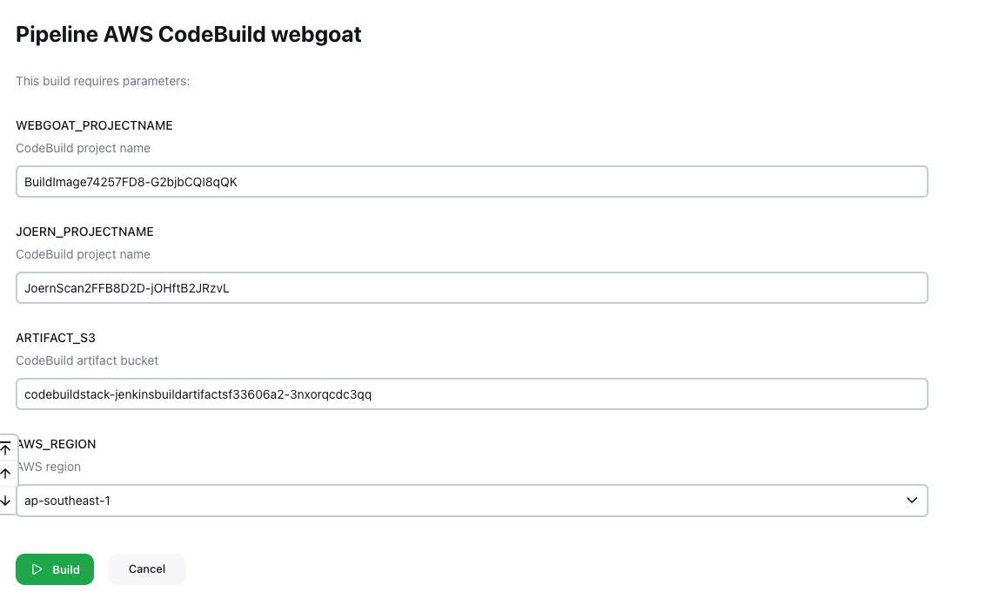

# DevSecOps Jenkins Scanner

This guide provides step-by-step instructions for setting up a DevSecOps Jenkins scanner using AWS native services and Jenkins. Follow these instructions to automate security scanning in a webgoat application using CDK for infrastructure provisioning and Jenkins DSL for pipeline configuration.

## 1 Objective

The objective of this installation guide is to demonstrate how to use AWS native services and Jenkins to start automation security scanning in a webgoat application. The guide will cover the use of CDK for infrastructure provisioning and Jenkins DSL for pipeline configuration.

## 2 Technical Stack

The following technical stack will be used in this installation:

- Joern - application scanning
- [Integrating AWS CodeBuild into Jenkins pipelines](https://jenkinshero.com/integrating-aws-codebuild-into-jenkins-pipelines/)
- [Jenkins Configuration as Code](https://abrahamntd.medium.com/automating-jenkins-setup-using-docker-and-jenkins-configuration-as-code-897e6640af9d)
- CDK
- Jenkins
- Groovy
- Codebuild
- WebGoat

### 2.1 Overall Architecture

The stack will be provisioned using CDK. Please refer to the provided architecture diagram for an overview.


### 2.2 Folder Layout

The project has the following folder layout:

```
devsecops-jenkins-scanner
├── README.md
├── cdk-jenkins - CDK code
├── gauntlt - BDD scanning configuration file
├── jenkins-master-image - Jenkins configuration file
└── local - local docker development
```

## 3 Prerequisites

Before starting the installation, ensure that the following prerequisites are met:

- Docker installed
- AWS account with CLI access (`AWS_ACCESS_KEY_ID` and `AWS_SECRET_ACCESS_KEY`)

## 4 Provision

Follow the steps below to install and configure the DevSecOps Jenkins scanner.

### 4.1 AWS Resource Creation

1. Download the source code from the repository: `git clone <https://github.com/yiuc/devsecops-jenkins-scanner`>
2. Set up the environment:
    
    ```bash
    export AWS_PAGER=
    export AWS_REGION=ap-southeast-1
    export ACCOUNT=$(aws sts get-caller-identity --out json --query 'Account' | sed 's/"//g')
    
    ```
    
3. Create a private ECR repository for the "jenkins-master" image:
    
    ```bash
    aws ecr create-repository --repository-name jenkins-master --image-scanning-configuration scanOnPush=false --region $AWS_REGION
    
    ```
    
4. Manually build the Jenkins master image and upload it to ECR:
    
    ```bash
    docker build --platform linux/amd64 -t jenkins-master jenkins-master-image/. \\
    aws ecr get-login-password --region $AWS_REGION | docker login --username AWS --password-stdin $ACCOUNT.dkr.ecr.$AWS_REGION.amazonaws.com \\
    docker tag jenkins-master:latest $ACCOUNT.dkr.ecr.$AWS_REGION.amazonaws.com/jenkins-master:latest \\
    docker push $ACCOUNT.dkr.ecr.$AWS_REGION.amazonaws.com/jenkins-master:latest
    
    ```
    
5. List the Jenkins-master image in your ECR repository:
    
    ```bash
    aws ecr list-images --repository-name jenkins-master --region $AWS_REGION --output table
    
    ```
    

### 4.2 Jenkins Master

#### 4.2.1 Folder Layout

```
jenkins-master-image
├── Dockerfile - Docker file of Jenkins Master
├── Jenkinsfile - groovy script of pipeline
│   ├── codebuild-webgoat
│   ├── gauntlt-webgoat
│   └── pipelinejob
├── createJobs.groovy - the seed job to provision the pipeline in Jenkins file
├── plugins.txt - the plugin will be installed in Jenkins Master
└── seedJob.xml - Basic setup and create the seedjob
```

#### 4.2.2 Jenkins pipleine overview


1. access the Jenkins using NLB dns name


2. Execute the seed-job to provision the pipeline in Jenkins.
3. Execute `AWS_CodeBuild_webgoat` pipeline


4. update the codebuild name in parameter/configure/groovy 




### CodeBuild spec


### Challenge

1. Update your codebuild name in groovy and reflect in Jenkins Master
2. Speed up the deployment time 
2. Collect the codebuld log and show in Jenkins

## Clean up Action

To perform a clean action, follow these steps:

1. Destroy the provisioned resources.

    `cdk destoy --all`

2. Check the Log group for any remaining logs.
3. check you bill in next day

## Reference

- [AWS Jenkins ECS CDK Sample](https://github.com/aws-samples/aws-jenkins-ecs-cdk)
- [Deploy your own production-ready Jenkins in AWS ECS](https://jenkinshero.com/deploy-jenkins-into-aws-ecs/)
- [Deploying Jenkins into AWS ECS using CDK](https://jenkinshero.com/deploying-jenkins-into-aws-ecs-using-cdk/)
- [DevOps with serverless Jenkins and AWS Cloud Development Kit (AWS CDK) | Amazon Web Services](https://aws.amazon.com/blogs/devops/devops-with-serverless-jenkins-and-aws-cloud-development-kit-aws-cdk/)
- [Setting up a CI/CD pipeline by integrating Jenkins with AWS CodeBuild and AWS CodeDeploy | Amazon Web Services](https://aws.amazon.com/blogs/devops/setting-up-a-ci-cd-pipeline-by-integrating-jenkins-with-aws-codebuild-and-aws-codedeploy/)
- [Integrating AWS CodeBuild into Jenkins pipelines](https://jenkinshero.com/integrating-aws-codebuild-into-jenkins-pipelines/)
- [Environments - AWS Cloud Development Kit (AWS CDK) v2](https://docs.aws.amazon.com/cdk/v2/guide/environments.html)
- [AWS CDK Toolkit (cdk command) - AWS Cloud Development Kit (AWS CDK) v2](https://docs.aws.amazon.com/cdk/v2/guide/cli.html#cli-config)